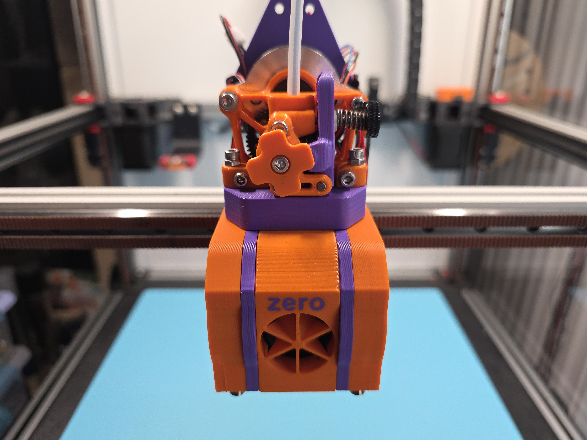

## MiniBurner XL Toolhead

This are the files for Miniburner XL Toolhead.

<table>
  <tr>
    <td></td>
    <td></td>
  </tr>
</table>

  

Its build for hotends with volcano lenght nozzle, has a 2510 hotend cooling fan, and dual 5015 "rehoused" part cooling fans.
For now only 3 hotend are suported, and extruder suport are for sherpa-mini and Orbiter v2 - v2.5.

I designet this toolhead to be compatible with the original Voron X-Carriage, and for [Klicky-Changer](https://github.com/printicus/Klicky-Changer)

